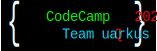

# Documentation

## Goals

* Explore alternative technologies for classic JEE-Applications and find migration-paths
  * Stateless Beans
  * Async request-handling
  * Message driven Beans
  * Dependency injections (CDI)
  * Container managed security?
  * Container managed transactions?
* Optimized for containerized runtimes
* Good feeling for Developer (handy tooling, short roundtrips)
* [Bucketlist](bucketlist.md)

## Predefined Scope
_Technologies supporting MicroProfiles_
* Wildfly Bootable-Jar
* Quarkus

## Agenda
* 01.11.2021 - Ramp-up. See [Day one](Day1.md)
* 02.11.2021 - Deep dives. See [Day two](Day2.md)
* 03.11.2021 - Variations. See [Day three](Day3.md)
* 04.11.2021 - Quarkus hands-on session with [Thorben Jägers (RedHat)](https://github.com/j1cken). See [Day four](Day4.md)
* 05.11.2021 - Reflection. See [Day five](Day5.md)
